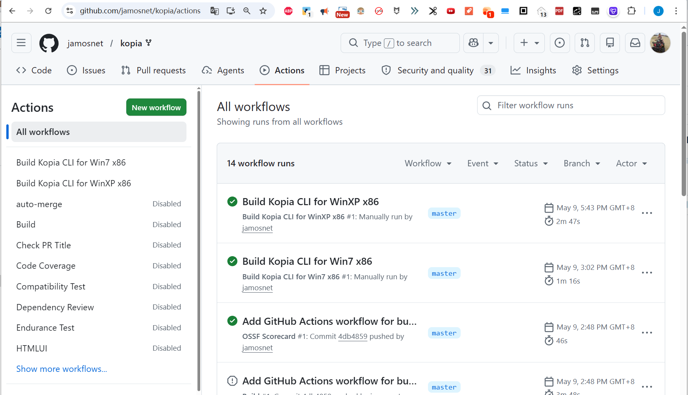

# Kopia Legacy & Dynamic VM Backup Solution

本仓库是基于 [Kopia](https://github.com/kopia/kopia) 的一个特殊 Fork 分支，旨在解决 **Windows XP (x86)** 和 **Windows 7 (x86)** 环境下，针对大规模动态虚拟机（VM）的自动备份需求。

> **核心背景**：Kopia 官方目前已不再提供 x86 (32位) 的预编译版本。为了支持老旧系统及特定的 x86 架构环境，本仓库通过定制的 GitHub Actions 重新实现了对这些平台的编译支持。

## 🌟 核心特性

- **跨代支持**：提供专为 XP（Go-nt51 补丁链）和 Win7（Go 1.20 链）编译的 `kopia.exe` 32位客户端。
- **动态 VM 适配**：采用 `KOPIA_SOURCE` 环境变量 + `--override-source` 参数，解决 100+ 动态虚拟机在同一 Server 端的标识冲突。
- **轻量级调度**：内置由 Delphi 7 开发的托盘启动器 (`kopia_backup_cron.exe`)，无需复杂的 Windows 任务计划程序即可实现定时后台备份。
- **极致兼容的 VSS 支持**：通过 Batch 脚本自动强制管理员权限，确保在旧系统上也能调用卷影复制（VSS）备份被占用的文件。

## 📁 目录结构与版本说明

针对不同系统，本方案分为三个核心套件：

| 目录名称 | 适用系统 | 编译引擎/特性 |
| :--- | :--- | :--- |
| `kopia-0.22.3-windows-64` | Win10/Win11 x64 | 官方核心版本 |
| `kopia-win7-x86-cli` | Windows 7 x86 | Go 1.20.14 (官方支持 Win7 的最后版本) |
| `kopia-winxp-x86-cli` | Windows XP x86 | Go-nt51 补丁 + `softfloat` (兼容老旧 CPU) |

每个目录下均包含：
- `kopia.exe`: 定制编译的客户端。
- `kopia_backup.bat`: 封装好的逻辑脚本。
- `kopia_backup_cron.exe`: 托盘调度程序。

## 🚀 关键逻辑实现

### 1. 动态源标识（解决多虚拟机冲突）
为了在不修改物理机名的情况下区分 100 多台虚拟机，我们在脚本中定义了：
```batch
set VM_NAME=Your_Unique_VM_ID
set KOPIA_SOURCE=vps@%VM_NAME%:C:
...
kopia.exe snapshot create C:\ --override-source="%KOPIA_SOURCE%"
```
*注：在 XP 系统中由于缺失 mklink，建议为每台设备在 Kopia Server 上分配独立的 User 账号。*

### 2. 极致的排除规则
为了减小备份体积，脚本默认排除了系统冗余文件（Windows 目录、Program Files、缓存、页面文件等），仅保护核心业务数据。

### 3. XP 兼容性修正
- **架构**：强制使用 `386` 架构。
- **浮点运算**：开启 `softfloat`，确保在不支持 SSE2 的极老 CPU 上也能正常运行。
- **权限管理**：脚本内置 `net session` 检测，确保以管理员身份运行以调用 VSS。

## 📸 运行截图
*(此处建议放入你准备好的三张截图：1. XP 运行截图；2. Win7 运行截图；3. Delphi 调度器托盘截图)*


## 🛠 如何构建 (GitHub Actions)
本项目在 `.github/workflows` 中提供了两套自动化构建流程：
- `build-win7-x86.yml`: 手动触发，产出 Win7 兼容版。
- `build-winxp-x86.yml`: 手动触发，使用 Backports 分支产出 XP 兼容版。
### 特别提醒，在创建yml前需要把原来的action全部设置为disabled ，否则在我们提交yml的时候会立即启动10几个自动构建



点击按钮Run workflow


大概3分钟构建好，然后展开找到 Artifact download URL ，点击即可下载


---

### 💡 为什么不直接用官方版？
1. **官方无 x86**：新版本 Kopia 基本不再发布 32 位程序。
2. **Go 环境限制**：Go 1.21+ 编写的程序无法在 Win7 以下运行。
3. **XP 支持断层**：只有通过特定的补丁版 Go 编译器，才能让 Kopia 这种现代备份工具跑在 XP 上。

---
[下载 Kopia 自动备份调度器的delphi7源码.zip](./Kopia%20自动备份调度器.zip)

[下载 kopia-0.22.3-windows-x64.zip](./00ExtraRes/kopia-0.22.3-windows-x64.zip)
[下载 kopia-win7-x86-cli.zip](./00ExtraRes/kopia-win7-x86-cli.zip)
[下载 kopia-winxp-x86-cli.zip](./00ExtraRes/kopia-winxp-x86-cli.zip)


###  docker的安装
参考官方文档    https://kopia.io/docs/installation/#docker-images

---

Kopia
=====


[](https://github.com/kopia/kopia/actions?query=workflow%3ABuild)
[](https://godoc.org/github.com/kopia/kopia/repo)
[](https://codecov.io/gh/kopia/kopia)[](https://goreportcard.com/report/github.com/kopia/kopia)
[](CODE_OF_CONDUCT.md)
[](https://hub.docker.com/r/kopia/kopia/tags?page=1&ordering=name)
[](https://github.com/kopia/kopia/releases)
[](https://gurubase.io/g/kopia)

> _n._
>
> 1. _[copy, replica](https://en.wikipedia.org/wiki/Replica) (Polish)_
> 2. _[lance, spear](https://en.wikipedia.org/wiki/Kopia)_
> 3. _[fast and secure backup tool](https://kopia.io)_


Kopia is a fast and secure open-source backup/restore tool that allows you to create [encrypted](https://kopia.io/docs/features/#user-controlled-end-to-end-encryption) snapshots of your data and save the snapshots to [remote or cloud storage](https://kopia.io/docs/features/#save-snapshots-to-cloud-network-or-local-storage) of your choice, [to network-attached storage or server](https://kopia.io/docs/features/#save-snapshots-to-cloud-network-or-local-storage), or [locally on your machine](https://kopia.io/docs/features/#save-snapshots-to-cloud-network-or-local-storage). Kopia does not 'image' your whole machine. Rather, Kopia allows you to backup/restore any and all files/directories that you deem are important or critical.

Kopia has both [CLI (command-line interface)](https://kopia.io/docs/features/#both-command-line-and-graphical-user-interfaces) and [GUI (graphical user interface)](https://kopia.io/docs/features/#both-command-line-and-graphical-user-interfaces) versions, making it the perfect tool for both advanced and regular users. You can read more about Kopia's unique [features](https://kopia.io/docs/features/) -- which include [compression](https://kopia.io/docs/features/#compression), [deduplication](https://kopia.io/docs/features/#backup-files-and-directories-using-snapshots), [user-controlled end-to-end encryption](https://kopia.io/docs/features/#user-controlled-end-to-end-encryption), and [error correction](https://kopia.io/docs/features/#error-correction) -- to get a better understanding of how Kopia works.

When ready, head to the [installation](https://kopia.io/docs/installation/) page to download and install Kopia, and make sure to read the [Getting Started Guide](https://kopia.io/docs/getting-started/) for a step-by-step walkthrough of how to use Kopia.

Pick the Cloud Storage Provider You Want
---

Kopia supports saving your [encrypted](https://kopia.io/docs/features/#user-controlled-end-to-end-encryption) and [compressed](https://kopia.io/docs/features/#compression) snapshots to all of the following [storage locations](https://kopia.io/docs/features/#save-snapshots-to-cloud-network-or-local-storage):

* **Amazon S3** and any **cloud storage that is compatible with S3**
* **Azure Blob Storage**
* **Backblaze B2**
* **Google Cloud Storage**
* Any remote server or cloud storage that supports **WebDAV**
* Any remote server or cloud storage that supports **SFTP**
* Some of the cloud storage options supported by **Rclone**
  * Requires you to download and setup Rclone in addition to Kopia, but after that Kopia manages/runs Rclone for you
  * Rclone support is experimental: not all the cloud storage products supported by Rclone have been tested to work with Kopia, and some may not work with Kopia; Kopia has been tested to work with **Dropbox**, **OneDrive**, and **Google Drive** through Rclone
* Your local machine and any network-attached storage or server
* Your own server by setting up a [Kopia Repository Server](https://kopia.io/docs/repository-server/)

And Kopia uses [data deduplication](https://kopia.io/docs/features/#backup-files-and-directories-using-snapshots) to save you money! Read the [repositories help page](https://kopia.io/docs/repositories/) for more information on supported storage locations.

With Kopia you are in full control of where to store your snapshots, that is, you pick the storage provider you want to use. You must provision and pay for the storage provider for whatever storage locations you want to use, and then tell Kopia what those storage locations are. You can even use multiple storage locations for different backup repositories if you want. Kopia also supports backing up multiple machines to the same storage location.

Kopia in Action
---

Using Kopia via command-line interface:

[](https://asciinema.org/a/ykx6uzEhKY3451fWEnX9nm9uo)

Using Kopia via graphical user interface (note: the video is of an older version of Kopia and the interface is different in the current version of Kopia, but the main principles of the interface are the same):

[](https://www.youtube.com/watch?v=sHJjSpasWIo)

Getting Started
---
See [Kopia Documentation](https://kopia.io/docs/) for more information. Also check out the [users forum](https://kopia.discourse.group).

Licensing
---
Kopia is licensed under the Apache License, Version 2.0. See [LICENSE](LICENSE) for the full license text.

Building Kopia
---
See [Build Infrastructure](BUILD.md) for more information on building Kopia and working with the source code.

Contribution Guidelines
---
Kopia is open source. For more information see the [Contribution Guidelines](https://kopia.io/docs/contribution-guidelines/).

Reporting Security Issues
---
If you find a security issue you'd like to disclose privately, please contact `security@kopia.io`.

[](https://app.netlify.com/sites/kopia/deploys)
